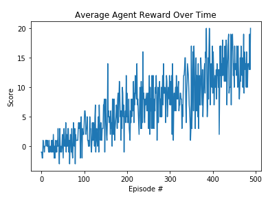

## Introduction

The aim of the project is to implement and train an agent to navigate (and collect bananas!) in a large, square world.

## Learning Algorithm

For handling this task I choose the Deep Q-Learning algorithm. This reinforcement learning algorithm represents the optimal action-value function q∗​ as a neural network with Experience replay and Fixed Q-Targets.
This algorithm is published in the DQN paper [Human-level control through deep reinforcement learning](https://storage.googleapis.com/deepmind-media/dqn/DQNNaturePaper.pdf)

## Model Architecture
The neural network is implemented in class QNetwork. The neural network maps state to action values. The network has three fully-connected layers and a Relu activation function in between the input and hidden layer. From experience, the network size is about good enough for our purpose. Too small a network might cause the model to quickly overfit also too large a network will result in longer training and model takes too long to converge.

## Hyperparameter

The agent implemented in class Agent. The replay buffer (memory)contains collections of experience tuples. In the network, I implement the Fixed Q-Targets as qnetwork_target.
I define various hyperparameter.
These hyperparameters are suggested for a DQN in the original paper (`Page. 10`), the implemented agent achieve professional human-level results playing over 2600 atari games. These hyperparameters were adapted with little tweaks for our purpose.

* BUFFER_SIZE (`1e5`) - specifies the size of our replay buffer, a change in this value affect the number of experience tuple held at any time to learn from.
* BATCH_SIZE (`64`) - the mini-batch size of the training sample. The batch size is adapted to 64 as we have fewer inputs (37) compared to the environments discussed in the paper.
* GAMMA (`0.99`) - discount factor for collected reward
* TAU (`1e-3`) - for the soft update of target parameters.
* LR (`5e-4`) - learning rate, a fraction of update to network weights.
* UPDATE_EVERY (`4`) - how often we learn from memory (repay buffer).
* eps_start (`1.0`), eps_end (`0.01`), eps_decay (`0.995`) - epsilon defines the probability for the agent exploring its environment. Initially, this value is one (entirely exploration) but staidly reduces (more exploitation) by eps_decay. Still, the minimum eps is eps_end so the agent always gets the chance of exploring its environment.

## Plot of Rewards

At about 389 episodes the agents already solve the environment. The average reward at the state is +13.
A plot of the average reward for the is training period can be seen below.

## Ideas for Future work

1. As observed from the plot, continuos training of the agent will improve performance as the agent is no way near the optimal policy.
2. An optimization for Deep Q-Learning networks is to prioritize experience replay. The idea is that an agent can learn more from some transitions than from others, hence the more important transition should be sampled with higher probability. This has not been implemented in this project.

